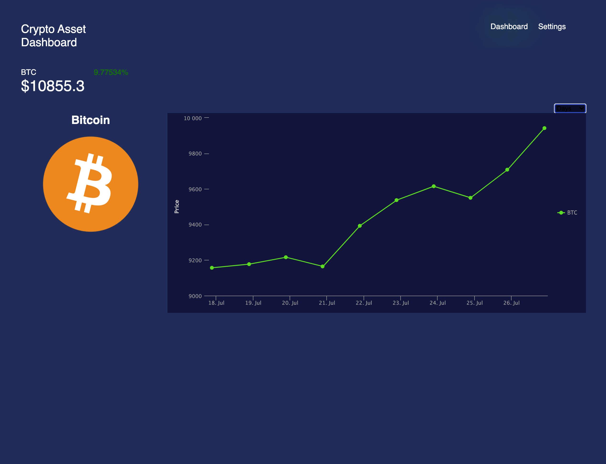

# crypto-asset-dashboard



View live market data for all your crypto assets!

## Overview

This application showcases working with external market datasources to present near real-time information in pretty graphs and charts! This project was a _code-a-long_ which follows along with this [course](https://react.school/).

To get started:

```
$ npm install
$ npm run start
http://localhost:3000 # in your browser if it doesn't open automatically
```

Additionally, you can use Docker to build and deploy this application locally:

```
$ docker build . -t <tag>
$ docker run <tag>
http://localhost:3000 # in your browser if it doesn't open automatically
```

## Technologies & Frameworks

- [Create React App](https://facebook.github.io/create-react-app/)
- [React](https://reactjs.org/)
- [Styled Components](https://www.styled-components.com/)
- [Highcharts](https://www.highcharts.com/)
- [Cryptocompare](https://www.cryptocompare.com/)
- [Docker](https://www.docker.com/)
