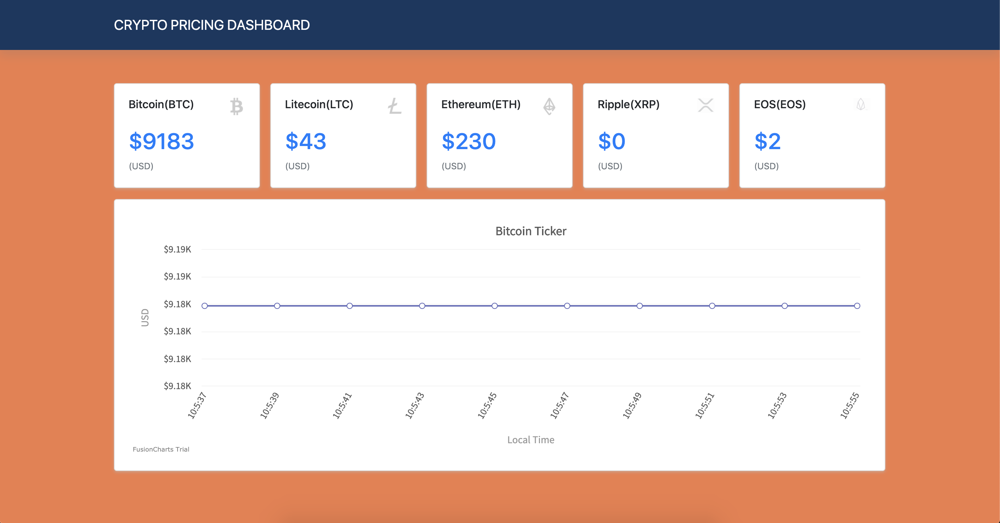

# crypto-asset-dashboard

A basic dashboard app displaying real-time crypto asset prices.



## Installation

```
npm install
npm start
open http://localhost:3000 # if doesn't open on its own
```

## Frameworks

- [Create React App](https://facebook.github.io/create-react-app/)
- [React](https://reactjs.org/)
- [FusionCharts](https://www.fusioncharts.com/)
- [React-Bootstrap](https://react-bootstrap.github.io/)
- [Crypto API Pricing Data](https://www.cryptonator.com/api/ticker/)
