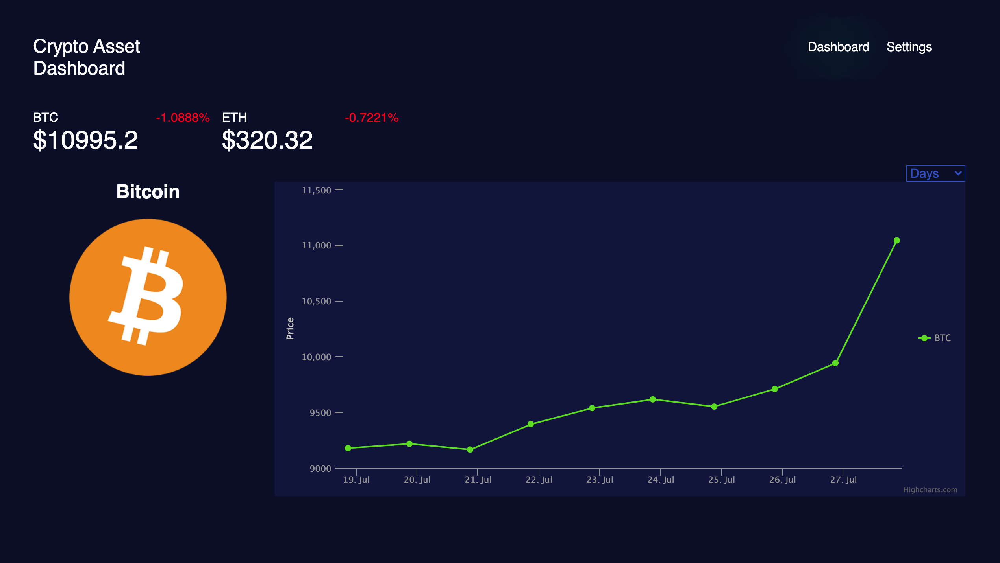

# crypto-asset-dashboard

View various real-time Crypto asset market data!



---

## Overview

There are two ways of running this locally, with each option requiring the same steps to Start each of the Application Services:

A.) NPM

```
npm install
npm run start
http://localhost:3000 # open in browser if it doesn't open automatically
```

B.) Docker

```
docker build -t <tagName> .
docker run <tagName>
http://localhost:3000 # open in browser to view application
```

---

## Technologies & Frameworks

- [Create React App](https://facebook.github.io/create-react-app/)
- [React](https://reactjs.org/)
- [Highcharts](http://getbootstrap.com/)
- [Styled Components](https://www.styled-components.com/)
- [Cryptocompare](https://www.cryptocompare.com/)
- [Docker](https://www.docker.com/)

---

_Special Thanks to React.School's Udemy "code-a-long" course!_
